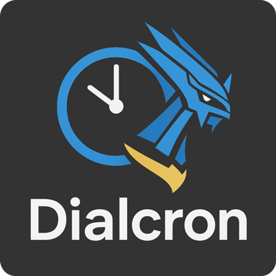

# Dialcron - Projeto React

## Como executar este projeto

### 1. Pré-requisitos

* Node.js instalado (versão 16 ou superior)
* npm ou yarn

### 2. Instalação

```bash
npm install
```

### 3. Executar o projeto

```bash
npm run dev
```

### 4. Build para produção

```bash
npm run build
```

---

## Estrutura do Projeto

```bash
src/
├── components/
│   ├── Menu/           ← Menu principal (barra superior)
│   ├── Modal/          ← Componente reutilizável para popups
│   ├── Documentacao/   ← Esta documentação
│   ├── Configuracao/   ← Conteúdo do menu Configuração
│   ├── Atendimento/    ← Conteúdo do menu Atendimento
│   └── Sobre/          ← Informações sobre o projeto
├── main.jsx            ← Entry point
├── App.jsx             ← Componente principal
├── index.css           ← Estilos globais
├── FundoInfinito.*     ← Background visual
└── Agendamento.*       ← Página de agendamento
```

---

## Tecnologias

* React 18.2.0
* React DOM 18.2.0
* React Calendar 6.0.1
* Vite 4.4.0

---

## Contato

Arthur / Dialcron
